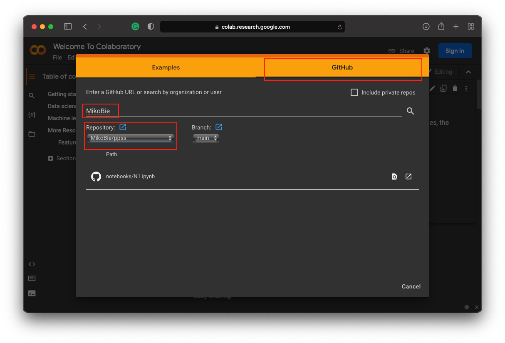

# `Programming in Python for Social Scientists`

This repo is for the class on 'Programming in Python for Social Scientists' at the Faculty of Psychology, University of Warsaw. It was mostly designed to use with Google Colab, but if you know what you are doing you can use it with Anaconda or any other environment with Jupyter Notebook App. In the folder slides, there are subfolders with `LaTeX` files for building `pdf` files. You are welcome to use them if you know `LaTeX` and you have `xelatex` installed.

## Google Colab

Users who want to use the materials online in `Google Colab` should follow these steps to access the interactive notebooks:

1. Go to [www.colab.research.google.com](https://colab.research.google.com/) (it is better to have a Google Account but not necessary).
2. Press GitHub in the popup window or press File and Open notebook.
3. Type `MikoBie` in the search box (compare the picture below).

4. Pick the relevant repository: `ppss`
4. Choose the relevant notebook and click Open Notebook.

That is it, an interactive notebook should open. Or alternatively you can use the links below:

* [Overview of basic programming concepts](https://colab.research.google.com/github/MikoBie/ppss/blob/main/N1.ipynb)
* [Branching and Iterations](https://colab.research.google.com/github/MikoBie/ppss/blob/main/N2.ipynb) ([Homework Assignment 1](https://colab.research.google.com/github/MikoBie/ppss/blob/main/HW1.ipynb))
* [Operations on strings](https://colab.research.google.com/github/MikoBie/ppss/blob/main/N3.ipynb) ([Homework Assignment 2](https://colab.research.google.com/github/MikoBie/ppss/blob/main/HW2.ipynb))
* [Functions](https://colab.research.google.com/github/MikoBie/ppss/blob/main/N4.ipynb) ([Homework Assignment 3](https://colab.research.google.com/github/MikoBie/ppss/blob/main/HW3.ipynb))
* [Tuples, Lists, Aliasing, Mutability, and Cloning](https://colab.research.google.com/github/MikoBie/ppss/blob/main/N5.ipynb) ([Homework Assignment 4](https://colab.research.google.com/github/MikoBie/ppss/blob/main/HW4.ipynb))
* [Dictionaries (mappings) and JSON](https://colab.research.google.com/github/MikoBie/ppss/blob/main/N6.ipynb)
* [Files](https://colab.research.google.com/github/MikoBie/ppss/blob/main/Data_Analysis.ipynb) ([Homework Assignment 5](https://colab.research.google.com/github/MikoBie/ppss/blob/main/HW5.ipynb))

## Jupyter Notebook App

For more advanced users I recommend running Jupyter Notebooks on their local machines. In the long shot, it is just easier.

### Main Dependencies

* _python3.9_ ([anaconda distribution](https://www.anaconda.com/products/distribution) is preferred)
* other _python_ dependencies are specified in `requirenments.txt`

### Setup

1. Cloen the repo: `git@github.com:MikoBie/ppss`
2. Set up the proper virtual environment with _python3.9_
3. Install all the dependencies from `requirenments.txt`

## LaTeX

For building all presentations and manuals from the source code you need to have `TexLive2019` or newer installed on your machine and `Latin modern family of fonts`. I used `xelatex` to build them.

